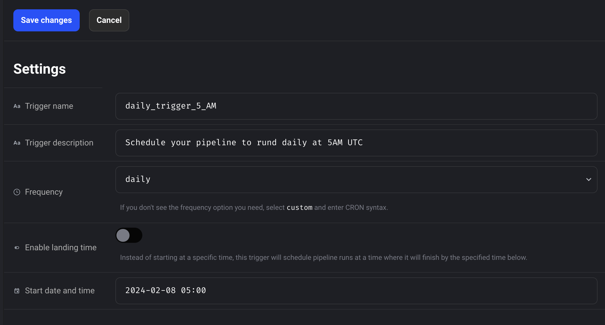
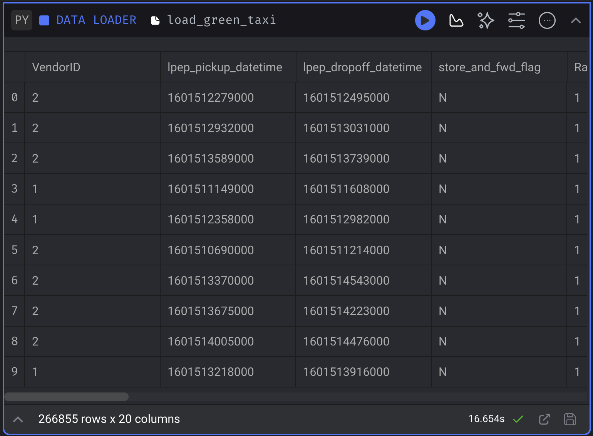

## Work 2 Homework

Attention: At the end of the submission form, you will be required to include a link to your GitHub repository or other public code-hosting site. This repository should contain your code for solving the homework. If your solution includes code that is not in file format, please include these directly in the README file of your repository.

For the homework, we'll be working with the green taxi dataser located here:

`https://github.com/DataTalksClub/nyc-tlc-data/releases/tag/green/download`

You may need to reference the link below to download via Python in Mage:

`https://github.com/DataTalksClub/nyc-tlc-data/releases/download/green/`

## Assignment

The goal will be to construct an ETL pipeline that loads the data, performs some transformations, and writes the data to database (and Google Cloud!).

- Create a new pipeline, call it `green_taxi_etl`
- Add a data loader block and use Pandas to read data for the final quarter of 2020 (months `10`, `11`, `12`).
  - You can use the same datatypes and date parsing methods shown in the course
  - `BONUS`: load the final three months using a for loop and `pd.concat`

I use the following code

```Python
@data_loader
def load_data(*args, **kwargs):
        
    # Base URL for the files
    base_url = "https://github.com/DataTalksClub/nyc-tlc-data/releases/download/green/green_tripdata_2020-"

    # Months of the files to download
    months = ['10', '11', '12']

    # Declare the datatypes of the columns
    taxi_dtypes = {
                    'VendorID': pd.Int64Dtype(),
                    'passenger_count': pd.Int64Dtype(),
                    'trip_distance': float,
                    'RatecodeID':pd.Int64Dtype(),
                    'store_and_fwd_flag':str,
                    'PULocationID':pd.Int64Dtype(),
                    'DOLocationID':pd.Int64Dtype(),
                    'payment_type': pd.Int64Dtype(),
                    'fare_amount': float,
                    'extra':float,
                    'mta_tax':float,
                    'tip_amount':float,
                    'tolls_amount':float,
                    'improvement_surcharge':float,
                    'total_amount':float,
                    'congestion_surcharge':float
                }

    # Parsing the datae columns
    parse_dates = ['lpep_pickup_datetime', 'lpep_dropoff_datetime']

    # List to store the dataframes of each file
    dfs = []

    for month in months:
        # Construct the full URL
        url = f"{base_url}{month}.csv.gz"
        
        # Load the dataframe and append it to the list
        df = pd.read_csv(url, sep=",", compression="gzip", dtype=taxi_dtypes, parse_dates=parse_dates)
        dfs.append(df)

    # Concatenate all the dataframes into one
    df_final = pd.concat(dfs, ignore_index=True)

    return df_final
```

- Add a transformer block and perform the following:
  - Remove rows where the passenger count is equal to 0 and the trip distance is equal to zero.
  - Create a new column `lpep_pickup_date` by converting `lpep_pickup_datetime` to a date.
  - Rename columns in Camel Case to Snake Case, e.g. `VendorID`to `vendor_id`

Here is the Python code:

```Python
@transformer
def transform(data, *args, **kwargs):
    # Removing the rows with passenger count equal 0
    data = data[data['passenger_count'] > 0]

    # Removing rows with trip distance equal 0
    data = data[data['trip_distance'] > 0]

    # Creating a new column lpep_pickup_date by converting lpep_pickup_datetime to a date
    data['lpep_pickup_date'] = data['lpep_pickup_datetime'].dt.date

    # Renaming the columns in Camel Case to Snake Case
    data.columns = (data.columns
                .str.replace('(?<=[a-z])(?=[A-Z])', '_', regex=True)
                .str.lower()
             )
    
    return data
```

  - Add three assertions:
    - `vendor_id` is one of the existing values in the column (currently)
    - `passenger_count`is greater than 0
    - `trip_distance`is greater than 0

With the following code 

```Python
@test
def test_output(output, *args) -> None:
    #Assert for vendor_id column
    assert 'vendor_id' in output.columns, 'There no exist the column vendor_id'
    
    #Assert for pasenger_count is greater than 0
    assert output['passenger_count'].isin([0]).sum() == 0, 'There are rides with zero passengers'

    #Assert for tripdistance is greater than 0
    assert output['trip_distance'].isin([0]).sum() == 0, 'There are rides with zero trip distance'
```

- Using a Postgres data exporter (SQL or Python), write the dataset to a table called `green_taxi` in a schema `mage`. Replace the table if it already exists.

Using the followin code in the data exporter block

```Python
def export_data_to_postgres(df: DataFrame, **kwargs) -> None:

    schema_name = 'mage'  # The name of the schema
    table_name = 'green_taxi'  # The name of the table
    config_path = path.join(get_repo_path(), 'io_config.yaml')
    config_profile = 'dev'

    with Postgres.with_config(ConfigFileLoader(config_path, config_profile)) as loader:
        loader.export(
            df,
            schema_name,
            table_name,
            index=False,  
            if_exists='replace',  # Replacing the table if it exists.
        )
```

- Write your data as Parquet files to a bucket in GCP, partitioned by `lpep_pickup_date`. Use the `pyarrow` library!

I use the following block for data loading to GCS

```Python

#Loading the required libraries

import pyarrow as pa
import pyarrow.parquet as pq
import os

if 'data_exporter' not in globals():
    from mage_ai.data_preparation.decorators import data_exporter

#Setting the credentials to connect to GCS

os.environ['GOOGLE_APPLICATION_CREDENTIALS'] = "credentials"

#Setting the name of the bucket_name and the object_key

bucket_name = 'your_bucket_name' #The original bucket name is erased

table_name = "green_taxi_data" #The green taxi data

root_path = f'{bucket_name}/{table_name}' Include a root path for each day

#Following, it is the function to load the data to GCS

@data_exporter
def export_data(data, *args, **kwargs):

    table = pa.Table.from_pandas(data)

    gcs = pa.fs.GcsFileSystem()

    pq.write_to_dataset(
        table, 
        root_path =root_path,
        partition_cols = ['lpep_pickup_date'],
        filesystem = gcs 
    )
```

- Schedule your pipeline to run daily at 5AM UTC



## Questions

## Question 1. Data Loading

Once the dataset is loaded, what is the shape of the data?

- `266,855 rows x 20 columns`
- 544,898 rows x 18 columns
- 544,898 rows x 20 columns
- 133,744 rows x 20 columns

The answer can be checked once you load the data in Mage.



## Question 2. Data Transformation

Upon filtering the data where the passenger count is greater than 0 and the trip distance is greater than zero, how many rows are left?

- 544,897 rows
- 266,855 rows
- `139,370 rows`
- 266,856 rows

Once the data is in Postgres you can run the following SQL command.

```SQL
SELECT COUNT(1)
FROM mage.green_taxi;
```

The answer is 139,370 rows.

## Question 3. Data Transformation

Which of the following creates a new column `lpep_pickup_date` by converting `lpep_pickup_datetime` to a date?

- `data = data['lpep_pickup_datetime'].date`
- `data('lpep_pickup_date') = data['lpep_pickup_datetime'].date`
- `data['lpep_pickup_date'] = data['lpep_pickup_datetime'].dt.date`
- `data['lpep_pickup_date'] = data['lpep_pickup_datetime'].dt().date()`

The correct answer is `data['lpep_pickup_date'] = data['lpep_pickup_datetime'].dt.date`, the other code lines will throw an error.

## Question 4. Data Transformation

What are the existing values of VendorID in the dataset?

- 1, 2, or 3
- `1 or 2`
- 1, 2, 3, 4
- 1

Using the following SQL command in Postgres:

```SQL
SELECT DISTINCT vendor_id
FROM mage.green_taxi;
```

## Question 5. Data Transformation

How many columns need to be renamed to snake case?

- 3
- 6
- 2
- `4`

Since we are using the same datatypes and date parsing shown in the course. Here is the dictionary 

```Python
    taxi_dtypes = {
                    'VendorID': pd.Int64Dtype(),
                    'passenger_count': pd.Int64Dtype(),
                    'trip_distance': float,
                    'RatecodeID':pd.Int64Dtype(),
                    'store_and_fwd_flag':str,
                    'PULocationID':pd.Int64Dtype(),
                    'DOLocationID':pd.Int64Dtype(),
                    'payment_type': pd.Int64Dtype(),
                    'fare_amount': float,
                    'extra':float,
                    'mta_tax':float,
                    'tip_amount':float,
                    'tolls_amount':float,
                    'improvement_surcharge':float,
                    'total_amount':float,
                    'congestion_surcharge':float
                }
```

Therefore, `VendorID`, `RatecodeID`, `PULocationID`, and `DOLocationID` (4) need to be renamed to snake case.

## Question 6. Data Exporting

Once exported, how many partitions (folders) are present in Google Cloud?

- `96`
- 56
- 67
- 108

Here is a photo of the partitions obtained in GCS


The closest one is 96.
